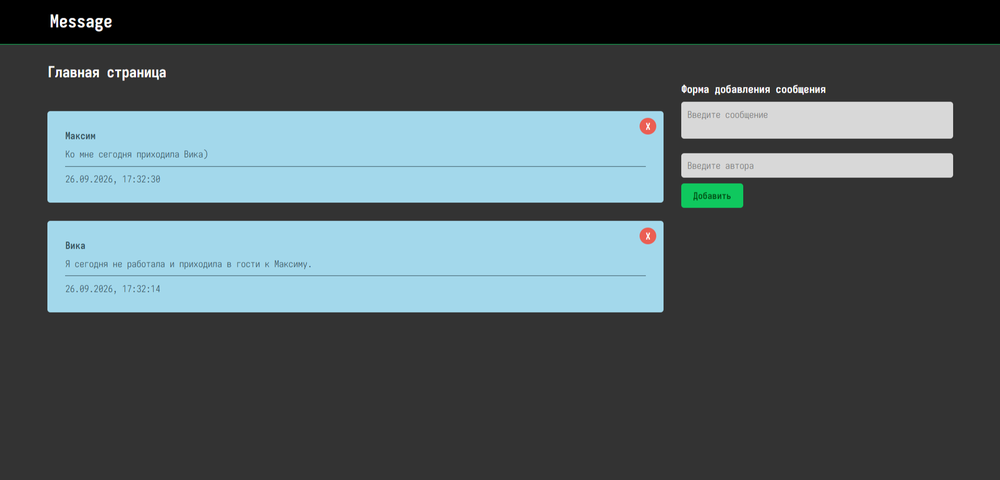

# 📝 MERN Blog
Full-stack CRUD-приложение на **React + Node.js + Express + MongoDB**.

🔗 **Demo:** https://superpnz.github.io/mern-blog/
📦 **GitHub:** https://github.com/Superpnz/mern-blog

## 🚀 Возможности

* создание сообщений
* удаление сообщений
* отображение автора, текста и даты создания
* автоматическое отображение даты в локальном времени

## 🛠️ Стек

**Frontend**

* React 19
* Vite
* JavaScript
* Context API
* React Hooks

**Backend**

* Node.js
* Express
* REST API
* Mongoose

**Database**

* MongoDB Atlas

**Deployment**

* GitHub Pages
* GitHub Actions
* Render

## 📸 Preview



## 🏗️ Структура

```text
mern-blog/
├── .github/
│   └── workflows/
│       └── deploy.yml
│
├── screenshots/
│   └── mern-blog.png
│
├── public/
│   ├── src/
│   │   ├── components/
│   │   │   ├── Header.jsx
│   │   │   ├── Home.jsx
│   │   │   ├── MessageDetail.jsx
│   │   │   └── MessageForm.jsx
│   │   ├── context/
│   │   ├── api.js
│   │   ├── App.jsx
│   │   └── main.jsx
│   ├── .env.production
│   └── vite.config.js
│
└── server/
    ├── controllers/
    ├── models/
    ├── routes/
    ├── index.js
    └── package.json
```

## 🔌 REST API

```text
GET    /api/message/
GET    /api/message/:id
POST   /api/message/
PATCH  /api/message/:id
DELETE /api/message/:id
```

Frontend взаимодействует с backend через `fetch`.

## 🧠 Что демонстрирует проект

* разработка full-stack приложения с нуля
* разделение frontend и backend
* создание REST API
* CRUD-операции с MongoDB
* работа с React Hooks и Context API
* разделение backend на `routes / controllers / models`
* использование environment variables
* настройка CORS
* Git и Conventional Commits
* автоматический deployment через GitHub Actions

## 🌐 Deployment

```text
React + Vite
     ↓
GitHub Pages
     ↓
Express REST API
     ↓
Render
     ↓
MongoDB Atlas
```

Frontend автоматически собирается и публикуется через **GitHub Actions** при push в `main`.

## ⚙️ Запуск

### Frontend

```bash
cd public
npm install
npm run dev
```

### Backend

```bash
cd server
npm install
npm run dev
```

Backend требует переменную окружения:

```env
MONGO=your_mongodb_connection_string
```

## 👨‍💻 Автор

**Maxim Anikeev / Superpnz**

GitHub: https://github.com/Superpnz
